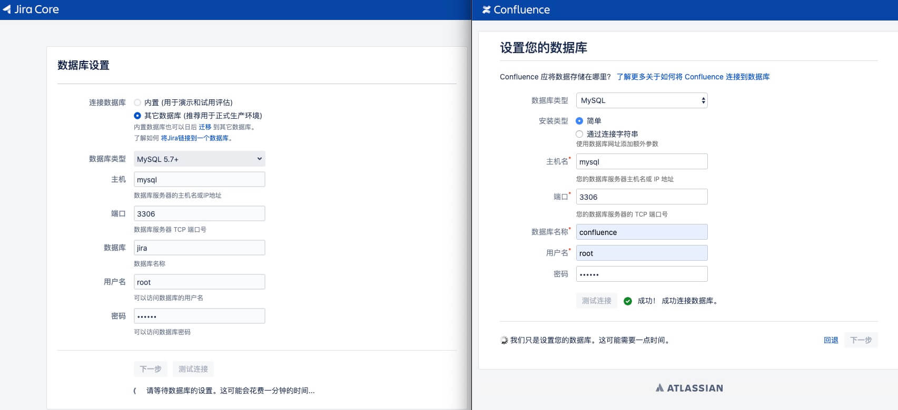

# jira-confluence

## Jira + Confluence
```bash
git clone https://github.com/colin-chang/jira-confluence.git
cd jira-confluence && sudo mkdir jira confluence mysql && sudo chmod -R 777 jira confluence
docker-compose up -d
```

## Crack
```bash
# jira
docker exec atlassian-jira java -jar /var/agent/atlassian-agent.jar \
    -p jira \
    -m zhangcheng5468@gmail.com \
    -n zhangcheng5468@gmail.com \
    -o http://192.168.0.202 \
    -s 202
    
# confluence
docker exec atlassian-confluence java -jar /var/agent/atlassian-agent.jar \
    -p conf \
    -m zhangcheng5468@gmail.com \
    -n zhangcheng5468@gmail.com \
    -o http://192.168.0.202 \
    -s 202
```

## Crack plugin 
```bash
# biggantt 
docker exec atlassian-jira java -jar /var/agent/atlassian-agent.jar \
    -p eu.softwareplant.biggantt \
    -m zhangcheng5468@gmail.com \
    -n zhangcheng5468@gmail.com \
    -o http://192.168.0.202 \
    -s 202
```

## DB connection

